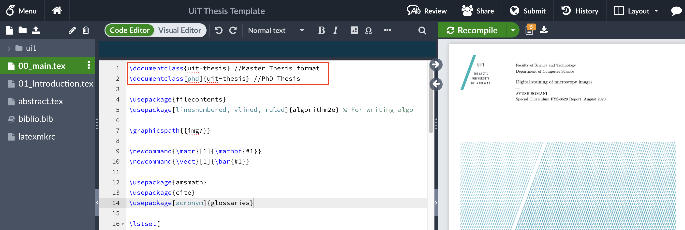
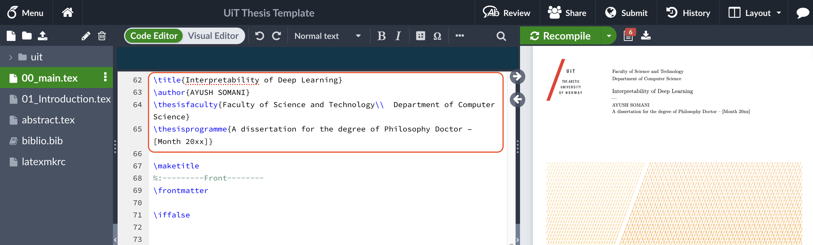

# UiT The Arctic University of Norway - Thesis Submission Latex Templates 

Welcome to the repository dedicated to easing the process of thesis submission for students and researchers at UiT The Arctic University of Norway. 

## About UiT Thesis Submission

At UiT, the thesis submission process has been a cornerstone in validating the hard work and research carried out by students. The official [UiT thesis submission guidelines](https://en.uit.no/studenter/oppgaveskriving) provide a comprehensive outline for students to follow.

However, we understand that many of you have been struggling with finding the right LaTeX template that aligns with UiT's requirements to successfully submit your Master's thesis, PhD thesis, or special curriculum report. That's precisely what this repository is here to address!

## What This Repository Offers

In this repository, you will find:

- **LaTeX Source Files**: Tailored for both Master and PhD level theses, these LaTeX files are pre-formatted to meet the official UiT guidelines.
- **Compiled PDF Examples**: For each LaTeX template, there's a corresponding PDF file to showcase what the finished document should look like.
- **Step-by-Step Guide**: We've included a guide to help you through the process of compiling the LaTeX files into a PDF.

## How to Use

1. **Choose Your Template**: Navigate through the repository to find the LaTeX template that corresponds to your academic level - Master's or PhD.
2. **Download and Edit**: Download the .tex files and edit them with your thesis content.
3. **Compile to PDF**: Use Overleaf or your preferred LaTeX editor to compile the files into a PDF.
4. **Submit Your Work**: Once your thesis is ready, follow UiT's submission process to turn in your masterpiece.

## Visual Aids

To make things even easier, we've included GIFs and images that guide you through the process of editing and compiling your LaTeX files.

*Figure 1: Editing the LaTeX template in Overleaf*

## Contributing

Your contributions are what make this resource better for everyone. If you have suggestions or improvements, please fork this repository and submit a pull request. Let's make thesis submission a breeze together!

---

Happy Writing, and best of luck with your thesis at UiT The Arctic University of Norway! 🎓✨

---

*This README is part of an open-source project and is not affiliated with UiT The Arctic University of Norway.*
